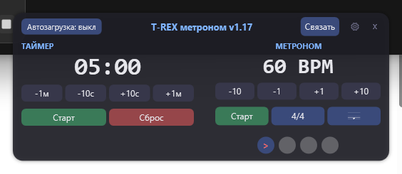

# T-REX Metronome — metronome + practice timer for Windows 🦖⏱

A frameless always-on-top desktop widget that combines a metronome and a practice
timer. Written as a **single-file PowerShell script with a WPF/XAML UI** and compiled
to a **standalone portable .exe** — no installation, no dependencies; all sounds are
synthesized on first launch, so nothing is written to your system except one
settings file.

Built for drum practice: accented beats, subdivisions (eighths / sixteenths /
triplets), a linked timer that always plays the current bar out to the end, and an
automatic JSONL training log.



## Features

- **Metronome**: 30–300 BPM, time signatures 2–8, custom accented beats (click the
  dots under the tempo); the playing beat is highlighted.
- **Subdivisions**: quarter / eighth / sixteenth / triplet clicks. BPM always means
  the quarter-note tempo; inner clicks are quieter, accents stay on the beats.
- **Practice timer** with alarm; **link mode**: when the timer hits zero, the current
  bar plays out to the end before everything stops.
- **Training mode** (`-autoStart`): a "session failed" button and an automatic JSONL
  training log with all session parameters.
- Remembers window position, opacity, tempo, time signature, accents and the timer
  preset between runs.
- Single instance (a second launch just raises the existing window), autostart
  toggle, opacity via mouse wheel.
- Portable: one `.exe`, or run the `.ps1` directly with PowerShell 5.1+ — no admin
  rights required.

## Download

Get `t_rex_metr.exe` from the [Releases](../../releases) page. The executable is
unsigned — Windows SmartScreen will ask for confirmation ("More info → Run anyway").
Sounds (`tm_*.wav`) are created automatically next to the exe on first launch.

Or run from source:

```powershell
powershell -NoProfile -ExecutionPolicy Bypass -File .\TimerMetronome.ps1
```

## CLI

`-seconds -bpm -beats -div -accents -opacity -link -exitOnFinish -autoStart -label -logPath`
(short aliases `-t -b -r -d -c -o -l -e -a -m -p`; the full parameter table and
examples are in the Russian section below — parameter names are self-explanatory).

## Build

```powershell
pwsh -NoProfile -ExecutionPolicy Bypass -File build_exe.ps1    # requires the ps2exe module
```

The source is deliberately Windows PowerShell 5.1-compatible and saved as UTF-8 with
BOM. Close all running instances before rebuilding — ps2exe over a running exe
silently keeps the old binary.

## For AI agents

Single-file WPF app: XAML in a here-string → `XamlReader.Load` → `FindName`; UI state
in `$state`, settings in `tm_settings.txt`, training log — JSONL append. Keep the
source PS 5.1-compatible, UTF-8 with BOM; see `AGENTS.md`.

## License

MIT © Valentin Surovtsev

---

# T-REX метроном (по-русски)

Прозрачный виджет «таймер + метроном» для Windows. Автор: Валентин Суровцев.

## Возможности

- Окно поверх всех окон, перетаскивается мышью, закрывается крестиком или правым кликом.
- Прозрачность 20–100 %: колёсиком мыши над виджетом или панелью под шестерёнкой (справа вверху).
- Таймер с кнопками −1м / −10с / +10с / +1м, «Старт/Пауза», «Сброс»; на нуле — тройной сигнал.
- Метроном с кнопками −10 / −1 / +1 / +10, «Старт/Стоп», выбор размера такта 2–8 (кнопка «4/4»).
- Дробление доли (кнопка с нотой): четверти → восьмые → шестнадцатые → триоли. BPM задаёт темп четверти, дробление добавляет тихие щелчки внутрь доли; акценты звучат только на самих долях.
- Сильные доли: точки под метрономом, клик переключает сильная/слабая (синяя точка с красным `>` = сильная, звучит выше). Текущая доля при звучании подсвечивается кольцом и увеличивается.
- Режим «Связать»: одна кнопка Старт у таймера и метронома; при нуле таймера такт доигрывается до конца, затем всё останавливается и звучит сигнал.
- Запоминает между запусками: позицию, прозрачность, темп, размер такта, сильные доли, стартовое время таймера.
- Автозагрузка по кнопке в шапке (ярлык в автозагрузке пользователя).
- Повторный запуск не создаёт второе окно — поднимает уже открытое.
- Режим тренировки (`-autoStart`): кружок «успешно» в левом нижнем углу и лог тренировок в JSON.

## История версий

- **v1.0–v1.1** — первый выпуск: безрамочное Topmost-окно, прозрачность колёсиком, звуки генерируются при первом запуске, режим «Связать».
- **v1.2** — иконка T-REX (динозавр + круг таймера).
- **v1.3** — CLI-параметры.
- **v1.4** — `-autoStart` (сразу начать отсчёт после запуска).
- **v1.5** — параметр `-beats` (размер такта); exe переименован в `t_rex_metr.exe`.
- **v1.6** — сохранение позиции окна; параметр `-opacity`; дефолт — правый нижний угол.
- **v1.7** — настраиваемые сильные доли (точки под метрономом, параметр `-accents`).
- **v1.8** — регулятор прозрачности, кнопка «Автозагрузка», защита от второго экземпляра.
- **v1.9** — прозрачность убрана под шестерёнку, «Автозагрузка» — в шапку; авто-высота окна.
- **v1.10** — подсветка текущей доли; в настройках теперь сохраняются bpm, такт, доли и стартовое время таймера; «Сброс» возвращает к последнему стартовому времени.
- **v1.11** — лог тренировок при `-autoStart`: кружок «успешно», запись в `tm_trainings.jsonl`.
- **v1.12** — параметр `-logPath` для своего пути лога.
- **v1.13** — кружок «успешно» с барабанными палочками; в связанном режиме такт доигрывается до конца при нуле таймера.
- **v1.14** — лог пишется в момент завершения тренировки (ноль таймера или снятие кружка), а не при закрытии окна; в режиме тренировки шапка красная; окно «О программе».
- **v1.15** — в связанном режиме сигнал окончания звучит после доигранного такта (финальная доля слышна), а не в момент нуля.
- **v1.16** — дробление доли: четверти/восьмые/шестнадцатые/триоли (кнопка с нотой, параметр `-div`); BPM — по-прежнему темп четверти, промежуточные щелчки тише; дробление сохраняется в настройках и пишется в лог тренировки.
- **v1.17** — поле дробления в логе тренировки переименовано в `Duration` — длительность ноты (`4`=четверть, `8`=восьмая, `16`=шестнадцатая, `3`=триоль; та же нотация, что у `-div`); раньше это поле называлось `Div`.

## Параметры CLI

```
t_rex_metr.exe [-seconds <N>] [-bpm <N>] [-beats <N>] [-div <4|8|16|3>] [-accents <список>] [-opacity <N>] [-link] [-exitOnFinish] [-autoStart] [-label <строка>] [-logPath <путь>]
```

| Параметр | Сокращение | По умолчанию | Описание |
|---|---|---|---|
| `-seconds <N>` | `-t` | сохр. / `300` | время таймера на старте, в секундах (10…5999); 0 = «не задано» |
| `-bpm <N>` | `-b` | сохр. / `60` | темп метронома (30…300); 0 = «не задано» |
| `-beats <N>` | `-r` | сохр. / `4` | размер такта 2…8 (4 = 4/4); 0 = «не задано» |
| `-div <N>` | `-d` | сохр. / `4` | дробление доли: `4` — четверти, `8` — восьмые, `16` — шестнадцатые, `3` — триоли (BPM — темп четверти); мусорное значение = «не задано» |
| `-accents <список>` | `-c` | сохр. / `1` | сильные доли: номера через запятую с 1 (напр. `1,3`; вне размера такта игнорируются); пусто = «не задано» |
| `-opacity <N>` | `-o` | сохр. / `100` | стартовая прозрачность в % (20…100) |
| `-link` | `-l` | выкл. | режим «Связать» (общая кнопка Старт у таймера и метронома) |
| `-exitOnFinish` | `-e` | выкл. | закрыть виджет, когда таймер дойдёт до нуля |
| `-autoStart` | `-a` | выкл. | сразу начать отсчёт после запуска (включает кружок «успешно» и лог тренировки) |
| `-label <строка>` | `-m` | GUID | метка тренировки для лога |
| `-logPath <путь>` | `-p` | рядом с exe | путь к файлу лога тренировок (абсолютный — как есть, относительный — от каталога виджета; дефолт `tm_trainings.jsonl`) |

«По умолчанию»: сначала берётся значение, сохранённое при последнем закрытии (кроме переключателей), его нет — дефолт из таблицы. Явно переданное значение всегда бьёт сохранённое.

## Примеры

```bat
rem таймер на 5 минут, метроном 120 BPM, связаны
t_rex_metr.exe -seconds 300 -bpm 120 -link

rem размер такта 3/4 (вальс)
t_rex_metr.exe -b 120 -beats 3

rem такт 4/4, сильные доли 1-я и 3-я
t_rex_metr.exe -b 120 -accents 1,3

rem восьмые при том же темпе (щелчок каждые полдоли)
t_rex_metr.exe -b 120 -div 8

rem тренировка на триолях
t_rex_metr.exe -t 600 -b 90 -div 3 -autoStart -exitOnFinish -label "триоли 10мин"

rem «поставил и забыл»: стартует сразу, по окончании закроется сам, окно на 80% непрозрачности
t_rex_metr.exe -t 300 -b 120 -r 5 -link -autoStart -exitOnFinish -opacity 80

rem тренировка с логом: автостарт, автовыход, запись с меткой «рюкзак 20мин»
t_rex_metr.exe -t 1200 -b 100 -autoStart -exitOnFinish -label "рюкзак 20мин"

rem то же, но лог пишется по своему пути (один файл, события дописываются)
t_rex_metr.exe -t 1200 -b 100 -autoStart -exitOnFinish -label "рюкзак 20мин" -logPath "D:\Дневник\тренировки.jsonl"
```

## Лог тренировок

Пишется только при `-autoStart`, в момент завершения тренировки:

- таймер дошёл до нуля — запись с `Success:true` (в связанном режиме — после конца доигранного такта);
- клик по кружку «успешно» (левый нижний угол, зелёный с палочками) = «тренировка НЕ удалась»: запись с `Success:false`, виджет закрывается сразу;
- закрытие крестиком/правым кликом до завершения — запись НЕ пишется.

В записи: метка (или GUID), время старта/финиша, `Duration` (длительность ноты: 4/8/16/3), все параметры старта, `Completed` (автовыход по `-exitOnFinish`) и `Success`. Фактический хронометраж сеанса можно получить как разность `Finished − Started`.
